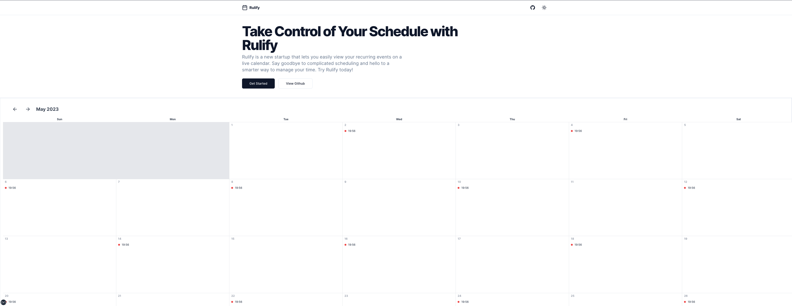

# Rulify

Rulify is a comprehensive web application designed to help users visualize their recurrence rules (RRULEs) on an interactive calendar. The application simplifies the process of understanding and managing recurring events, providing a seamless experience for users. Rulify is hosted at [rulify.conceptcodes.dev](https://rulify.conceptcodes.dev).

## Features

### Intuitive Calendar Interface
Rulify provides an easy-to-use, visually appealing calendar interface that allows users to view and manage their recurrence rules. The calendar supports navigation between months and years, making it effortless to visualize recurring events over an extended period.

### Visualization of Recurrence Rules
With Rulify, users can input existing RRULE strings to instantly view the resulting recurring events on the calendar. This feature enables users to quickly understand and verify the behavior of their RRULEs.

### Customization Options
Rulify supports a wide range of recurrence rule options, including frequency, interval, count, and byweekday. Users can adjust these parameters to create and visualize complex recurring patterns that suit their needs.

### Compatibility with Standard RRULE Strings
Rulify is compatible with standard RRULE strings used in popular calendar applications and services. This compatibility allows users to import and export RRULE strings, making it easy to work with other scheduling tools and platforms.

## Getting Started

To start using Rulify, simply visit [rulify.conceptcodes.dev](https://rulify.conceptcodes.dev). The web application is accessible from any modern web browser, and no installation or setup is required.

## Usage

1. **Open the Rulify web application**: Navigate to [rulify.conceptcodes.dev](https://rulify.conceptcodes.dev) in your preferred web browser.

2. **Enter an existing RRULE string**: You can input an existing RRULE string to view the recurring events on the calendar. 
Alternatively, add events manually to create a custom recurrence pattern.

3. **Visualize the recurring events**: View the recurring events on the interactive calendar to gain a better understanding of the recurrence pattern.

## Contributing

Rulify is an open-source project, and we welcome contributions from the community. If you have any suggestions, improvements, or bug reports, please feel free to open an issue or submit a pull request. We value your feedback and look forward to collaborating with you.

## License

Rulify is licensed under the [MIT License](https://opensource.org/licenses/MIT). See the LICENSE file for more details. This license allows you to use, modify, and distribute the project, making it suitable for personal and commercial purposes.